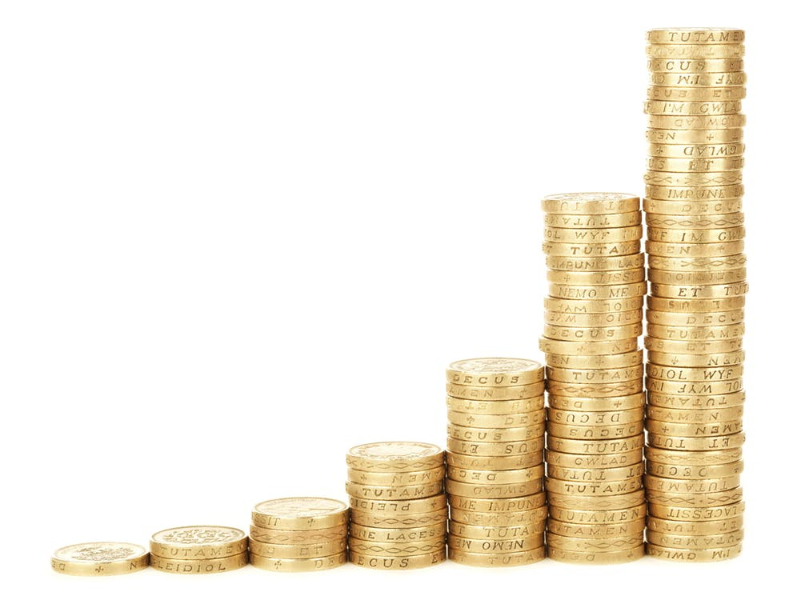
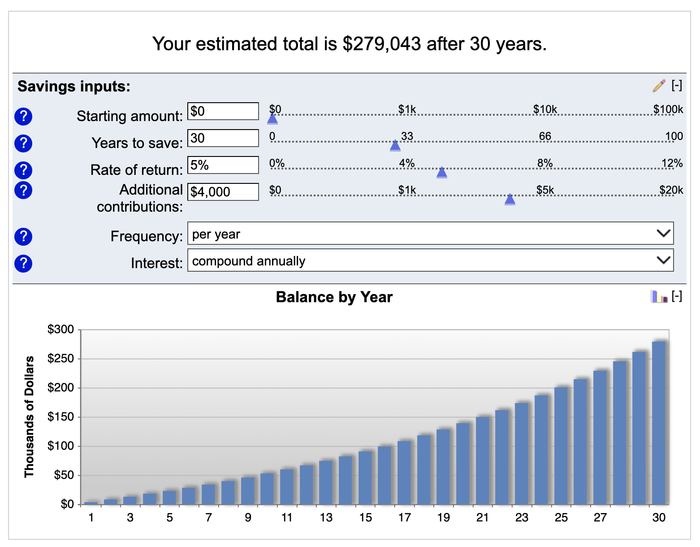

This post was inspired by a similar one from [The Frugal Gene](https://www.thefrugalgene.com/compound-interest-formula/). Check out her blog for more excellent content!

---

> “Compound interest is the eighth wonder of the world. He who understands it, earns it…he who doesn’t…pays it.” - Albert Einstein

People say this guy knew what he was talking about and I tend to agree here! In this post I’ll break down the ins and outs of compound interest - how it can help you, hurt you, and why it’s of the most important tools on your path to wealth.

## What is compound interest?

There are two types of interest: simple & compound. Simple interest is just a fixed percentage of principal every year. Compound interest is “interest on interest” - it’s the interest received (or paid) on top of the returns from the prior interest. At this point, some of you might be saying WTF you talking about Matt? Let me break it down with an example.

Let’s say you save $10,000 at a 5% interest rate. After the first year, you earn $500, and your new total balance is \$10,500.

In your second year, the 5% interest rate is calculated on your new balance of $10,500 - NOT the original balance. So your interest earned in the 2nd year is $525, and your new total is \$11,025. Can you see where this is going now?

| Year | Simple | Compound |
| ---- | ------ | -------- |
| 1    | 10500  | 10500    |
| 2    | 11000  | 11025    |
| 3    | 11500  | 11576    |
| 4    | 12000  | 12155    |
| 5    | 12500  | 12763    |
| 6    | 13000  | 13401    |
| 7    | 13500  | 14071    |
| 8    | 14000  | 14775    |
| 9    | 14500  | 15513    |
| 10   | 15000  | 16289    |

Now \$1289 over 10 years may not seem like a huge amount, but if you keep depositing into the account and save for even longer, there will be huge gains 💵💵💵

## The formula

Now before you run away cause I said maths, I can assure you formula is pretty simple:

`Principle * (1 + Rate) ^ Time = Amount`

**Principle**: Starting amount  
**Rate**: Returns from investments  
**Time**: Number of years  
**Amount**: The stacks you will receive 💰

## The Rule of 72

This is a quick shortcut that tells you how long it will take for your money to double. If your interest rate is 10%, it will take you 72/10=7.2 years to double your money.

## The dark side of compound interest

Now let’s look back to the 2nd part of Einstein’s quote - “he [or she] who doesn’t…pays it”. The big banks and credit card companies also recognize the power of compound interest - and that’s how they’re so successful. Let’s take the same example above but imagine the $10,000 is on a credit card instead. After 1 year, our interest the balance becomes $10,500, and then the bank gets to charge us interest on the newer balance. To make matters worse, the average credit card interest rate is 19.24%, which is why credit card debt is the worst form of debt and can get out of control super quickly!

<!-- > Related: How to master credit card usage (link coming soon). -->

## How to apply this wizardry in your life 🧙🏼‍♀️

The average salary for 25-34 year olds is $41,951 per year [(source)](https://smartasset.com/retirement/the-average-salary-by-age), so we’ll use $40,000 as a baseline. Assuming you can save 10% of your paycheck each year, here’s how your money would grow over 30 years with a 5% return rate. The result is almost \$280,000, and you only had to invest 120,000. Pretty cool right?

(Source: [Bankrate compound savings calculator)](https://www.bankrate.com/calculators/savings/compound-savings-calculator-tool.aspx)
