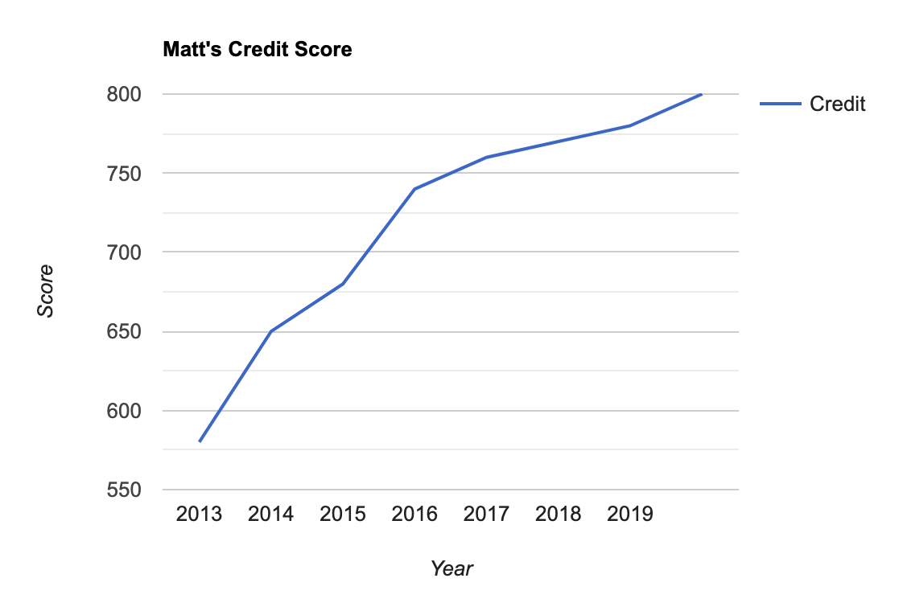

## Intro

Greetings readers! Today’s post will be a bit different from the others: I’ll be providing advice based on a personal story. It's about how I made my credit score go from 🗑️ to 🚀 and the steps I took to get there. Your results may vary - but the basic principles and methods should be the same. One thing to keep in mind is that this process takes time ⏳! You can damage your credit very quickly, but the repair process is quite slow.

## Disclaimer

In this article I suggest opening new credit cards as well as other types of debt-incurring accounts. As with all credit accounts: **use them responsibly**. If you open new credit cards but don’t pay them off each month - you may end up lowering your score even more! For more info about credit cards see [The 5 minute credit card guide](/credit-card-rewards).

## The Story

Let me take you back to 2011, when I was a fresh young, much less knowledgeable 18 year old. I was starting college, and decided to get my first credit card - a Wells Fargo college card with a whopping $700 limit. At this point I knew very little about personal finance, and thought that having a credit card meant I could buy things now and pay for them whenever I wanted to! While this is technically true - the longer you wait to pay the more you owe the bank, and that debt accumulates FAST. Before I knew it, I was in over my head with thousands of dollars of debt (yes, on a credit limit less than $1000). In addition to that card, I had racked up debt on my 76 gas card, and had been late for a few apartment payments. This ended up leaving me with 3 delinquent accounts and “poor credit” within 2 years of getting my first card.

## Asking for help

Here I was, 20 years old with a 580 credit score. Like I said - it’s really easy to tank your credit quickly if you’re not careful! Luckily, I did some research and decided the best option at that point was to hire a professional. Many people can fix their credit on their own depending on the severity, but in my case I had no clue where to start. I was living in Los Angeles at the time so I used a company called [Fix Your Credit Consulting](http://www.fixyourcreditconsulting.com/). There are plenty of services out there to help with this - but I would do some price shopping to ensure you’re not being ripped off. In the next section I’ll list out the steps we followed to get by credit back on track - all of which you can do on your own or with professional guidance.

## Steps to FYC (Fix Your Credit) ⚒️

### Step 1: Start monitoring your credit

The easiest (and most free) way I’ve found to do this is through [Credit Karma](https://www.creditkarma.com/). You’ll be able to see your scores, your credit factors, and they will monitor your reports for any suspicious activity. Additionally, you’re entitled to one free credit report per year through [Annual Credit Report.com](https://www.annualcreditreport.com/index.action) which is provided by the US government.

### Step 2: Deal with delinquent accounts (AKA face your creditors)

If your score is below 700, it’s likely that you have some delinquent or past-due accounts. The first thing to do is to call them up and explain your situation - then try to arrange a payment plan. Even if it’s \$10 a month, paying them anything will get you started towards removing the account (although it will take 7 years for them to officially come off your report - which is why it’s better not to get them in the first place). Do this one by one with each creditor - starting with the most delinquent to least.

### Step 3: Open new accounts

Once you’ve contacted the boogeymen 🧟, you can start opening new accounts to help boost your score. Initially it will be difficult to get approved for a regular credit card - but you can apply for a secured card to start (see [The 5 minute credit card guide](/credit-card-rewards)). From there - you should continue to open accounts and keep the ones you have open, utilizing as little as possible while keeping all accounts open and in good standing (autopay is your friend here 👯‍♂️).

## Maintaining your shiny new score ✨

So you just put in a bunch of work (likely over a few months or years) to get your score back on track. Now you want to keep it that way, right? Here’s a few guidelines to keep your shiny new score high (in order of importance)

1. Pay all your bills on time (seriously)
2. Keep credit card usage under 30% (the lower the better)
3. Don’t get any derogatory marks (collections, liens, etc)
4. Keep accounts open
5. Keep total # of accounts high
6. Keep inquiries low

You might think that at this point it’s a good idea to close those old accounts that got you the low score in the first place. DON’T DO IT 🚫. The longer your accounts are open, the higher your credit age and lower your usage will be - two very important credit score factors. I made this mistake and totally regret it - so hopefully I can save you that same regret!

## Takeaways

If you read this entire post and you already have good credit - then good on you and hopefully you can use the tips to help a friend! If you have bad credit - hopefully you learned a thing or two about how to change that. If you liked this post please share it or leave a comment below!
