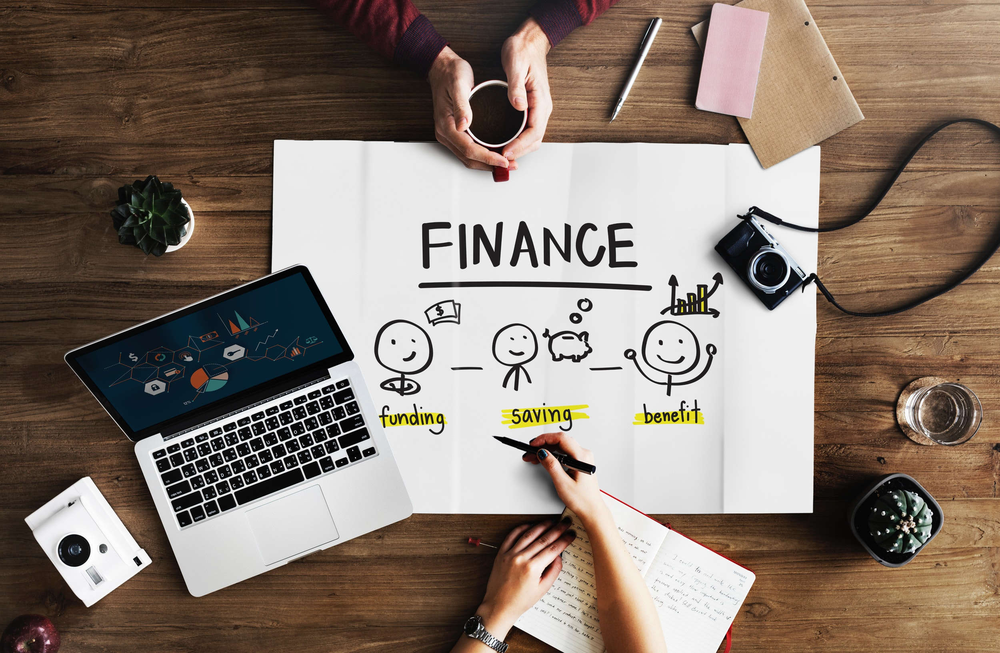

As you can probably tell so far, I’m a huge proponent of reducing your monthly expenses. The reason for this is really simple: building wealth requires you to save, invest, and minimize debt. I suggest aiming to save as much of your take home pay as possible: at least 10%, ideally 20-30%.

> Note: I realize that’s not possible for many people - especially those with families, but I do believe that everyone can find a way to cut back a bit and save more.

Don’t want to save that much? I get it, you work hard for that 🧀 and want to spend it. But the small cheddar you save today can add up to a whole ton of it later in life if you follow some simple steps.

<!-- > Related: (see more about how that money can grow here (link coming soon)). -->

If you’re still reading - you might be asking yourself **how** you can cut back spend, and save 5, 10, 20, or even 50 percent of your monthly income. Well, you’re in luck. My buddy sent me [this post](https://www.reddit.com/r/Frugal/comments/bzri83/what_are_your_best_tips_and_tricks_for_cutting/) the other day from [/r/frugal](https://www.reddit.com/r/Frugal/) that had some great tips on how to cut back. I’ve taken some from there, and added my own to get you started [^1].

1. Make a budget & track your expenses
   - [YNAB](https://www.youneedabudget.com/) (which stands for You Need a Budget) is my all time favorite budgeting and expense tracking tool. It costs \$7 a month, but is well worth it in the long run.
   - If you don’t want to pay for YNAB, [Mint](mint.com) is pretty good for basic expense tracking and budgeting. Use it to figure out where you can cut back.
   - Excel or google spreadsheets with a simple budgeting template can be just as effective if you are diligent about it.
2. Buying something on sale isn’t a “deal” if you didn’t plan on buying it
3. Take advantage of loyalty programs
4. Use credit cards for cash back (post on this coming soon)
   - Make sure to pay off your balance in full
5. Don’t buy coffee, make it (see [my post](/daily-coffee))
6. Replace cable with 1 or 2 streaming subscriptions
7. Get rid of the subscriptions you don’t need
8. Ride a bike to work (if possible)
9. Avoid impulse purchases by waiting 24 hours before buying anything unplanned
10. Shop the sales and buy in bulk
11. Return items you regret buying
12. Stop/cut back on eating out
    - If you must eat out, order something cheap and don’t get drinks
13. Avoid lifestyle inflation
    - ie : If you get a raise, keep your spending the same and invest the difference
14. Cook your own meals
15. Avoid food waste
16. Repair rather than replace
17. Avoid single-use items
    - Replace plastic bags with tupperware
    - Replace paper towels with microfiber cloth
    - Replace bottle water with tap water and a reusable bottle
18. Set-up automatic transfers to a savings and/or investment account
19. Buy higher quality products that will last longer
20. Refinance your loans if you can get a better interest rate

Do any of these simple changes sound doable? Am I crazy? Tell me in the comments!

[^1]: Credit for original list goes to reddit user [Sweatin_Butter](<[https://www.reddit.com/user/Sweatin_Butter/](https://www.reddit.com/user/Sweatin_Butter/)>).
